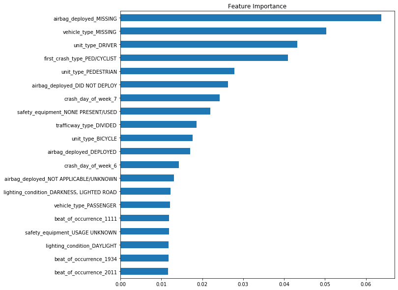

# Chicago Car Crash Data

## Predicting Chicago Car Accidents & Injuries 

## By: Hiten Patel 

In an average span of four days, the city of Chicago will record over one thousand traffic accidents. When you include the drivers, passengers, pedestrians and cyclists, potentially over two thousand people will be involved and 45% of them will experience a minor to fatal injury. 

The goal is to create a classification model to predict what are the leading indicators to what causes an accident that can result in an injury. 

If successful and the City of Chicago implements our recommendations, Chicago will see a decrease in injuries and fatalities, decrease in traffic and an overall increase in safety for all citizens.  

## Dataset

The source for the datasets came from the City of Chicago Website. There were three datasets that we observed, "Traffic Crashes - Crashes", "Traffic Crashes - Vehicle", and "Traffic Crashes - People". Then we merged them into one database. 

Column names and descriptions can be found here; 

Traffic Crashes - Crashes: https://data.cityofchicago.org/Transportation/Traffic-Crashes-Crashes/85ca-t3if

Traffic Crashes - Vehicle: https://data.cityofchicago.org/Transportation/Traffic-Crashes-Vehicles/68nd-jvt3

Traffic Crashes - People:
https://data.cityofchicago.org/Transportation/Traffic-Crashes-People/u6pd-qa9d

## Methodology: O.S.E.M.N Framework

>Obtain:
* Extracting the data from the following files;
    * Crash = https://data.cityofchicago.org/resource/85ca-t3if.csv
    * Vehicle = https://data.cityofchicago.org/resource/68nd-jvt3.csv
    * Person = https://data.cityofchicago.org/resource/u6pd-qa9d.csv

>Scrub:
* Explore the raw data set and understand the values
* Understanding the null values and evaluating the best steps to take to eliminate them
* Replacing values with meaningful data and converting data types
* Deleting irrelevant and redundant columns 

>Explore:
* Creating visualizations to better understand the data
* Engineering New Columns 
* Deriving statistics from the data

>Model:
 * Created multiple models including logistic regression, KNN, decision trees, bagging and random forest
 * Performed a gridsearch to each model to extract the best parameters 

>iNtrepret:
* Evaluating the accuracy score which led to the Bagging(Random Forest) classifier as the best model

## Results

### Original Data

The first steps to creating our model were to obtain and merge all three of the data sets into one. This created a table with 1289 entries and 149 columns. 

To trim the number of columns, we first calculated how many null values there were per column. Columns that had over 70% null values were removed and that calculation alone brought our column total to 74. 

Next, we removed redundant and irrelevant columns and this was decided by reviewing the "column descriptions" provided by the city of Chicago website. 

Furthermore, we either created bins or remapped the values to a more simple form to the following columns; 
   * crash_hour
   * age
   * posted_speed_limit
   * traffic_control_device
   * device_condition
   * weather_condition
   * first_crash_type
   * road_defect
   * vehicle_type
   * safety equipment
   * airbag_deployed
   * driver_vision

### Identifying Target

The target column will be 'injuries_total'. The data will be converted to '1' if you had one or more injuries and '0' if you had none. The column has been renamed to 'Injured'. 

### Preprocessing

Prior to preprocessing, we ran a train-test-split to ensure there will be no data leakage. 

At this point, the data had no numerical columns after the scrubbing and explore phase. For the categorical columns, we created a pipeline where the columns would go through a "simpleimputer" where missing values were filled with 'MISSING' and then push through a "oneHotEncoder" to create binary variables.

The last step was to check if there was a class imbalance and there was not. The data was ready to proceed into the modeling stage. 


### Model

The following models were tested which included logistic regression, k-nearest neighbors, decision trees, bagging-random forest and random forest.

Bagging - random forest returned a 89% accuracy rate. As we observe the confusion matrix, when the model predicted 0 (not injured) and the result was not injured, the model was correct 99% of the time. When the model predicted 1 (injured) and the result was injured, it was correct 73% of the time. 


## iNtrepretation 

We extracted the 'feature_importance' from the bagging classifier and created the chart below.

Crucial information is missing from two columns. First, airbag_deployed, this column could help tell us if an injury occurred or not occurred to a driver and second, vehicle_type, this column could help tell us which type of vehicles are most likely to get into a traffic accident.

The next observation we can make is that the most type of traffic accidents are drivers colliding with pedestrians and cyclist. 



The following graph shows the most involved types of units, meaning who is most likely involved within a traffic accident. We can also see the comparison who is injured and not injured. 


Furthermore, here is a graph to show the types of accidents that occur in Chicago and compares the not-injured/injured within each subset.


In addition to, after reviewing the data, we saw another interesting pattern. The majority of traffic accidents occur where there are 30mph, 35mph or 40mph posted speed limit signs. 


## Conclusion

Because the bagging classifier returned a 89% accuracy rate, we are confident in the following recommendations; 
* Ped/Cyclist should wear contrasting colors and should be more aware during afternoon/rush hour traffic
* The city can increase traffic signs and lanes that are more ped/cyclist friendly 
* The city lowers the speed limit during afternoon/rush hour (specifically in 30-40 mph zones) 

## Future Work 

The next steps to improve our model would be;
* retrieving driving records
* merging weather data 
* investigate why traffic control devices are not present or not working
* investigate why there is missing data


```python

```
